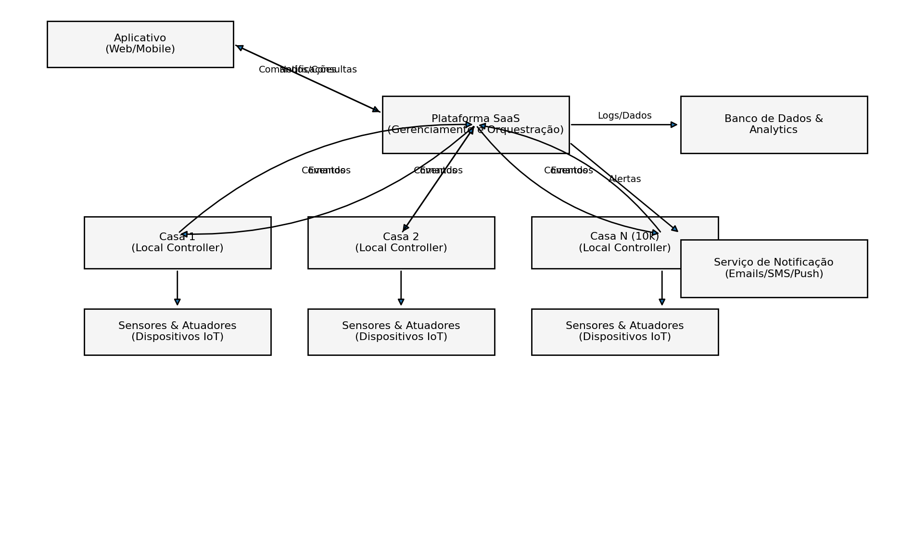
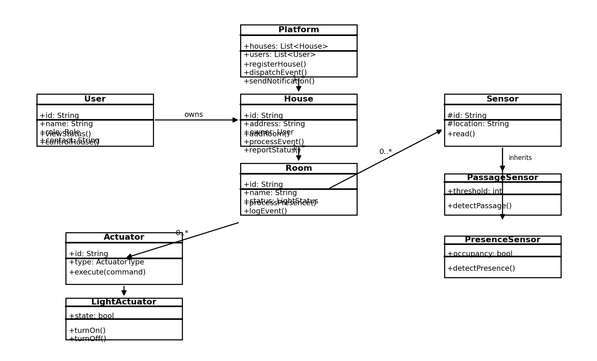
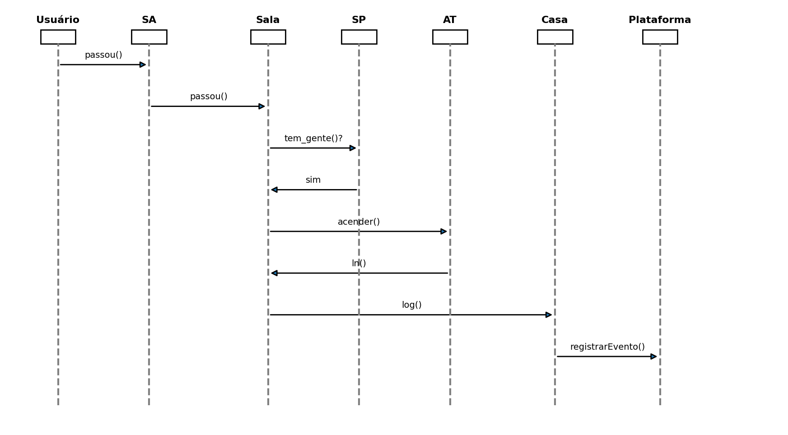
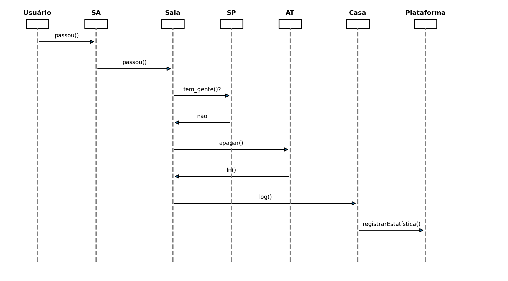
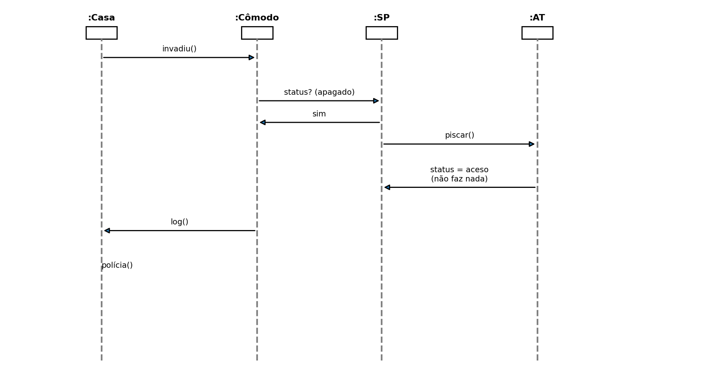
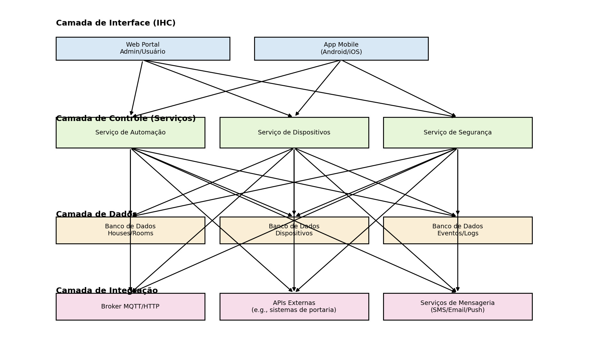

# Modelagem para Plataforma de Casas Inteligentes em Larga Escala

## Contexto do estudo de caso

Foi prosto à turma um estudo de caso no qual uma startup fornece automação para casas, oferecendo iluminação automática por presença, detecção de invasões com alarmes, desligamento automático das luzes, controle remoto de portões e observabilidade por dispositivos móveis.  A partir dos diagramas fornecidos em sala para uma única casa, deveríamos **escalar a solução para 10 000 casas** coordenadas por uma *plataforma digital como serviço* (SaaS) e analisar como a modelagem mudaria.

O problema deixa de ser de um único apartamento isolado e passa a envolver múltiplos componentes, integração com diversas casas, volume massivo de eventos e requisitos de segurança, privacidade e disponibilidade. Abaixo está uma modelagem de requisitos com base nas 5 visões propostas pela RM‑ODP (e avaliadas na ponderada)

## Visão 1 – Business Drivers (processo de negócios)

Para escalar a automação, a startup oferece uma **plataforma SaaS** que orquestra o ciclo de vida das casas e dispositivos.  O processo macro envolve os seguintes passos:

1. **Cadastro e provisão de casas/usuários:** o síndico (podemos supor) registra unidades habitacionais e moradores; a plataforma provisiona um *controlador local* por casa e associa sensores e atuadores.
2. **Rotina diária:** quando um morador se aproxima da portaria, o aplicativo consulta permissões na plataforma, abre o portão e atualiza o controle local. Ao entrar em um cômodo, sensores de passagem e presença enviam eventos; o controle local acende ou apaga as luzes, registra o evento localmente e o replica para a plataforma.
3. **Monitoramento e respostas:** a plataforma coleta logs, gera relatórios, executa rotinas de detecção de invasão e envia notificações (SMS, push ou e‑mail) para usuários e segurança do condomínio em caso de anomalias.
4. **Comando remoto:** moradores usam o aplicativo web/móvel para consultar o status da casa, acionar atuadores (luzes, portão) ou configurar automatizações. A plataforma autentica, autoriza e encaminha os comandos ao respectivo controlador local.

A figura a seguir resume esse fluxo em um diagrama de processo (BPMN) simplificado para milhares de casas.  A plataforma central se comunica com controladores locais, que por sua vez gerenciam sensores e atuadores, enquanto os usuários interagem via aplicativo.  Logs e alertas são enviados para bancos de dados e serviços de notificação.

## Visões 2 e 3 – Requisitos funcionais e não funcionais em UML

### Requisitos funcionais

- **RF‑1 – Gerenciar casas e usuários:** cadastrar/editar/excluir casas, moradores e perfis de acesso (proprietário, visitante, segurança).  Cada casa possui vários cômodos e cada cômodo pode conter sensores de passagem (SA), sensores de presença (SP) e atuadores (AT) para lâmpadas, portões etc.
- **RF‑2 – Gerenciar dispositivos IoT:** cadastrar sensores e atuadores com identificação, tipo e localização, associando‑os aos cômodos; permitir atualização de firmware e configurações.
- **RF‑3 – Acionamento automático de luzes:** quando o sensor de passagem detecta movimento, o controle local consulta o sensor de presença; se houver gente, solicita ao atuador acender a luz e registra o evento; quando não há mais presença, apaga a luz após um tempo configurável.
- **RF‑4 – Detecção de invasão:** se o sensor de presença detectar movimento em um cômodo vazio, o controle local liga a luz em modo piscante e notifica a plataforma; a plataforma registra o incidente, aciona alarmes sonoros e envia alertas para a segurança.
- **RF‑5 – Controle remoto:** permitir que o usuário ligue/desligue luzes, abra portões ou ative modos de férias via aplicativo web/móvel; os comandos são autenticados pela plataforma e encaminhados ao controlador local.
- **RF‑6 – Relatórios e observabilidade:** coletar e armazenar logs de presença, uso de dispositivos, incidentes e energia para cada casa; gerar relatórios estatísticos para moradores e síndicos.
- **RF‑7 – Integração com terceiros:** integrar‑se aos sistemas de portaria, serviços de emergência e APIs de notificação externa.

### Requisitos não funcionais

- **NFR‑1 – Escalabilidade e desempenho:** suportar **10 000 casas** e milhões de eventos diários.  A plataforma deve ser escalável horizontalmente, utilizando um *broker* de mensagens (MQTT/AMQP) e *sharding* de banco de dados para distribuir a carga.
- **NFR‑2 – Disponibilidade e tolerância a falhas:** o sistema deve operar 24 h por dia. Controladores locais devem continuar funcionando mesmo sem conexão com a internet, sincronizando eventos quando a comunicação for restabelecida.
- **NFR‑3 – Segurança e privacidade:** criptografar comunicação entre controladores e plataforma; autenticar todos os dispositivos; isolar dados entre casas; cumprir legislações como LGPD.
- **NFR‑4 – Tempo de resposta:** ações como acender luzes devem ocorrer em tempo real (< 500 ms).  A plataforma pode processar eventos em lote para relatórios, mas não pode atrasar respostas críticas.
- **NFR‑5 – Integração e padronização:** utilizar protocolos abertos (MQTT, HTTP/REST) para IoT; facilitar integração com sistemas de terceiros e evitar dependência de fornecedores.
- **NFR‑6 – Manutenibilidade e extensibilidade:** adotar uma arquitetura de microserviços para evoluir serviços (automação, segurança, dispositivos) de forma independente; testar exaustivamente e monitorar em produção.
- **NFR‑7 – Confiabilidade dos dados:** registros de presença e alarmes não podem ser perdidos; replicar e versionar dados de eventos.

### Modelagem estática em UML

Para representar as entidades da solução escalada foi criado um diagrama de classes.  A classe `Platform` centraliza o cadastro de casas e usuários e expõe operações de orquestração (`registerHouse`, `dispatchEvent`, `sendNotification`).  Cada `House` possui vários `Room`s, gerenciados por um controlador local.  Os `Room`s agregam sensores e atuadores (`Sensor`, `Actuator`), com especializações para sensores de passagem (`PassageSensor`) e presença (`PresenceSensor`) e atuadores de iluminação (`LightActuator`).  Um `User` pode possuir casas e enviar comandos via aplicativo.

### Modelagem dinâmica (cenários)

Os principais casos de uso foram representados por diagramas de sequência.  A seguir estão três exemplos com a inclusão da plataforma SaaS:

1. **Entrar em um cômodo:** o usuário aciona o sensor de passagem (`SA`), que informa a sala (`Sala`), consulta o sensor de presença (`SP`) e recebe a confirmação de que há gente.  A sala solicita ao atuador (`AT`) que acenda a luz e registra o evento na casa e na plataforma.

    

2. **Sair a última pessoa:** após a passagem, a sala consulta o sensor de presença; se ninguém estiver presente, pede ao atuador que apague a luz e registra uma estatística.

    

3. **Tratar invasão:** periodicamente (a cada 5 minutos) a casa verifica se houve invasão em algum cômodo.  Se um cômodo vazio estiver iluminado, o sensor de presença sinaliza invasão; o atuador pisca a luz e a casa registra o incidente e avisa a polícia.  A plataforma central recebe o log e dispara notificações.

    

## Visão 4 – Decisões de engenharia (componentes e mecanismos)

Para suportar os requisitos não funcionais, a arquitetura foi decomposta em componentes e mecanismos, como ilustra o diagrama abaixo.  A solução segue princípios de **microserviços** e **edge computing**:

 

- **Camada de Interface (IHC):** composta por um portal web (para administração do condomínio e moradores) e aplicativos móveis para os usuários finais.  Essas interfaces comunicam‑se com a plataforma via APIs seguras (HTTPS).  Autenticação e autorização são federadas, permitindo perfis e permissões diferentes.
- **Camada de Controle (Serviços):** reúne microserviços independentes, escaláveis e implícitos em contêineres.  O **Serviço de Automação** implementa regras de acendimento e desligamento, além de agendamentos; o **Serviço de Dispositivos** gerencia o ciclo de vida de sensores e atuadores, monitorando status e atualizando firmware; o **Serviço de Segurança** trata detecção de invasões e alarmes, podendo integrar‑se à portaria ou à polícia.
- **Camada de Dados:** bancos de dados diferentes para domínios distintos.  Uma base relacional armazena metadados de casas, cômodos e dispositivos; bases NoSQL mantêm logs de eventos, presença e consumo.  A replicação geográfica garante alta disponibilidade e baixa latência.
- **Camada de Integração:** implementa a comunicação com dispositivos IoT usando **MQTT**, traduzindo mensagens em objetos de domínio.  Outros adaptadores integram‑se a sistemas de portaria, serviços de emergência e plataformas de notificação (SMS, e‑mail, push).  Um serviço de mensageria central pode ser usado para orquestrar fluxos complexos e escalonar tarefas.
- **Controlador Local (Edge Device):** cada casa possui um dispositivo embarcado responsável por interagir diretamente com os sensores e atuadores por meio de protocolos como ZigBee, Z‑Wave ou Wi‑Fi.  O controlador executa as regras básicas mesmo sem internet e mantém uma fila de eventos para sincronizar com a plataforma quando a conexão retorna. (**Desta forma, temos certeza de que o sistema funciona mesmo sem conexão com a internet**)

Essas decisões de engenharia atendem aos requisitos de **escalabilidade**, **tolerância a falhas** e **segurança**: microserviços e bancos particionados permitem crescimento horizontal; a separação entre controlador local e plataforma reduz a dependência da nuvem; e a mensageria assíncrona absorve picos de eventos sem bloqueios.

## Visão 5 – Plataformas, linguagens e ferramentas

Para a implementação da solução em larga escala, recomenda‑se a seguinte stack tecnológica:

- **Controlador local:** dispositivo embarcado (ex.: Raspberry Pi, ESP32) executando um serviço escrito em **Python** ou **C++** para ler sensores e acionar atuadores, com suporte a protocolos ZigBee/Z‑Wave.  O firmware pode expor um *broker* MQTT local para comunicação com a plataforma.
- **Plataforma SaaS:** implementada como microserviços em **Node.js**, **Java** ou **Python**, executados em **contêineres (Docker)** e orquestrados por **Kubernetes**.  A comunicação entre serviços usa gRPC ou REST.  Para mensageria e *stream processing* usa‑se **Kafka** ou **RabbitMQ**.  Para dados relacionais, utiliza‑se **PostgreSQL**; para logs e telemetria, **MongoDB** ou **Cassandra**; para monitoramento, **Prometheus** e **Grafana**.  Autenticação e autorização podem ser centralizadas via **OAuth 2.0/OpenID Connect**.
- **Aplicativos web e móveis:** construídos com frameworks modernos como **React** (web) e **Flutter** ou **React Native** (móvel).  Esses clientes consomem as APIs expostas pelos microserviços e utilizam serviços de notificação push (Firebase Cloud Messaging, Apple Push Notification Service) para alertas.
- **Infraestrutura em nuvem:** hospedagem em provedores como AWS, Azure ou Google Cloud, com auto‑scaling, balanceamento de carga, rede privada virtual (VPC) e mecanismos de segurança (WAF, firewall).  Serviços gerenciados de banco de dados e mensageria reduzem a complexidade operacional.

## Conclusão da análise de expansão para 10 000 casas

Ao escalar a automação de uma casa para **10 000 casas**, a modelagem deixa de focar apenas em entidades internas (cômodos, sensores, atuadores) e passa a considerar **processos de negócio**, **governança de dados** e **infraestrutura**.  A introdução de uma **plataforma SaaS** implica tratar aspectos de multi‑inquilino, isolamento, orquestração e integração com terceiros.  A arquitetura resultante combina **edge computing** (controladores locais) com **serviços de nuvem** escaláveis, garante tempo de resposta adequado e mantém a privacidade dos moradores.  Essa estrutura modular também permite incorporar novos serviços (por exemplo, controle de climatização, gestão de energia) de forma incremental, apoiando o crescimento sustentável da startup.
